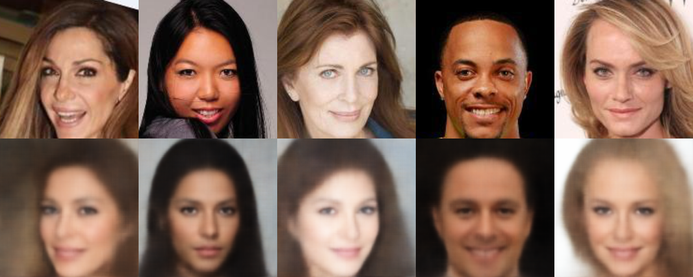

# Project description
Implementation of a Variational Autoencoder with Gaussian likelihood and Gaussian prior latent distribution (which implies that the true posterior and the posterior approximated by the encoder are also Gaussian). The loss function used to train this model is the weighted ELBO:
$$
\mathcal{L}_{\phi, \theta}(X) = \sum_{i=1}^{N} \mathcal{L}_{\phi, \theta}(X_{i}) = \\
 =\sum_{i=1}^{n}(\mathbb{E}_{\epsilon \sim \mathcal{N}(0, I)}[\log P_{\theta}(X_{i} \mid z)] - \beta D_{KL}[Q_{\phi}\mid \mid p(z)])$$

where $\beta \in [0, 1]$ is an annealing parameter used to devalue the KL divergence between the approximated posterior and prior distributtions. 

To test our implementation, we used the famous CelebA dataset which contains ~200 images of human faces (it can be found on [Kaggle](https://www.kaggle.com/datasets/jessicali9530/celeba-dataset)).

We used the following architecture:

First we show some of obtained reconstructions after training.

## Training reconstructitons

## Validation reconstructions

## Naive latent space sampling
The simplest form of sampling is to detach the encoder entirely, take a sample $\epsilon \sim \mathcal{N}(0, I_{l})$
(where $l$ is the dimensionality of the latent space, set to $l = 20$ for this experiment) and pass it thorugh the decoder. We present some of the obtained results with this techique:

The degree of realism is highly correlated to the portion of the latent space we end up in by sampling. More often than not, in the output we get a blurry reconstruction instead of something that resembles a realistic face.

## Weighted latent space sampling
The flaws of previous approach originate from the fact that we've attached the decoder entirely, and hence we've lost the reparameterization trick (affine transformation in case of Gaussian distributions). To circumvent this, we propose to first take a batch of $b$ images from the original dataset, and pass them through the encoder. So, for each image we obtain a $l$ dimensional mean vector, and a $l$ dimensional vector which represents the main diagonal of the covariance matrix. 
$$
    X = \{X_{1}, \ldots X_{b}\} \text{ samples taken from the dataset}
    \\
    (\mu_{i}, \log(\sigma_{i})) = Encoder_{\phi}(X_{i})$$

Afterwards we compute the weighted average of obtained vectors:
$$
\mu' = \sum_{i=1}^{b}\mu_{i}w_{i} \\
\log(\sigma') = \sum_{i=1}^{b}\log(\sigma_{i})w_{i}$$

where $w_{i} \in [0, 1]$ are the weights of choice. Now we take $\epsilon \sim \mathcal{N}(0, I_{l})$ and apply the reparameterization trick:
$$
    z = \mu' + \exp{log(\sigma')}\odot \epsilon$$

Finally, we pass $z$ through the decoder. This does not guarantee that the output image will be (in a way) a linear combination of the input images, however it does ensure that we will end up in a more suitable portion of the latent space.
We show some samples obtained with this technique for $b = 5$, and $w_{i} = \frac{1}{b}$:

# TODO
- Refactor passing hyperparameters through **config.py**.